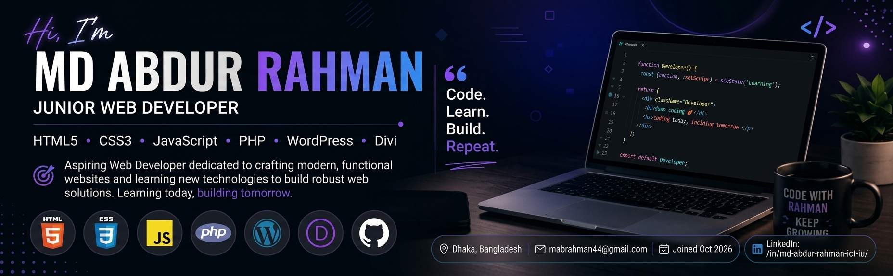

<!-- Banner Image (Make sure banner.jpeg is saved in your repository) -->

  

<!-- Title & Designation -->
<h1 align="center">Hi 👋, I'm Md Abdur Rahman</h1>
<h3 align="center">Junior Web Developer | Frontend & WordPress Specialist</h3>

<!-- Profile Views Badge -->

  

---

### 👨‍💻 About Me

I am an enthusiastic **Junior Web Developer** dedicated to crafting responsive, user-friendly, and modern web applications. With a strong foundation in frontend technologies and CMS platforms like WordPress, I enjoy turning creative ideas into functional digital products.

- 🔭 I’m currently working on building **modern full-stack web applications**.
- 🌱 I’m currently learning **Next.js & Server-Side Tracking Integration**.
- 👯 I’m looking to collaborate on **Open Source Frontend Projects**.
- 📍 **Location:** Dhaka, Bangladesh
- 💬 Ask me about **HTML, CSS, JavaScript, PHP, WordPress, and Divi**
- ⚡ Fun fact: **I love debugging complex CSS layouts over a warm cup of tea!**

---

### 🛠️ Tech Stack & Skills

#### Frontend Development

  
  &nbsp;
  
  &nbsp;
  
  &nbsp;
  
  &nbsp;
  

#### Backend & CMS

  
  &nbsp;
  
  &nbsp;
  

#### Tools & Platforms

  
  &nbsp;
  
  &nbsp;
  
  &nbsp;
  

---

### 🚀 Featured Projects

#### 🌐 B14-01 Assignment
A web development assignment project created during my learning journey to practice modern layout design.

- **Technologies:** HTML • CSS
- 🔗 [Live Demo](https://abdurrahmanictiu2015.github.io/b-14-assignment-01/)
- 🔗 [Repository](https://github.com/abdurrahmanictiu2015/b-14-assignment-01)

---

#### 🧩 Web Layout Project - Assignment 01
A responsive web application project built using HTML5 and custom CSS styling.

- **Technologies:** HTML • CSS
- 🔗 [Live Demo](https://abdurrahmanictiu2015.github.io/b-14-assignment-01/)
- 🔗 [Repository](https://github.com/abdurrahmanictiu2015/b-14-assignment-01)

---

### 📊 GitHub Stats

  
  

  

---

### 🌐 Connect With Me

  
  

---

  <i>"Learning today, building tomorrow."</i>

